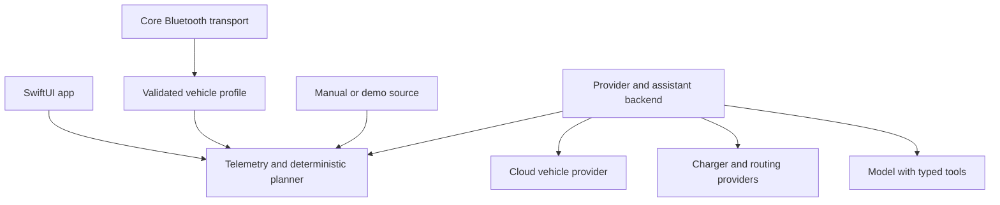

# Architecture

## Boundaries

The app owns local permission UX, the selected vehicle/adapter, connection lifecycle, user preferences, and the visible source/age of data. EVCore owns validated values, source/freshness rules, energy math, and eventually planning contracts. Platform effects and provider SDKs sit outside EVCore.

The proposed backend owns provider OAuth callbacks, credential storage, provider normalization, rate limits, model access, tool execution, and trace redaction. A future TypeScript service with versioned OpenAPI/JSON Schemas is a proposed implementation; do not create a service merely to relay local BLE samples. Local/manual planning must still work without the backend when enough data is available.

## Telemetry contract

Every production sample needs a scoped vehicle ID, observation time from the source, receipt time, source/provider, metric/unit, validity status, profile/version, and known uncertainty. The bootstrap `BatteryReading` implements only vehicle ID, percentage, observation time, and source; expand its contract before adding providers.

- A cached response's fetch time is not its observation time. Samples without trustworthy observation times are explicitly age-unknown and are not silently fresh.
- Keep displayed/dashboard SoC, BMS SoC, usable energy, gross capacity, and state of health as different fields.
- Fresh local data usually outranks fresh cloud data. Thresholds are configurable product policy, tested per source; bootstrap defaults are 30 seconds BLE, 5 minutes cloud, 30 minutes manual, and 60 seconds demo.
- Correlate the selected vehicle before combining sources. A recent sample from another car is unusable.
- A disconnect changes connectivity, not the historical measurement. Retain the last value with its original timestamp; transition visibly to stale, then request a fresh source/manual input.
- Manual entries are an explicit user choice. Demo data is opt-in and segregated. Zero is a valid reading; missing is a separate state.

## Bluetooth layering

`CBCentralManager` lifecycle → adapter-specific GATT transport → serialized diagnostic session → documented vehicle request/decoder → normalized telemetry. Each layer has its own state machine and failure contract. Inject clock, scheduler, transport, and recorded responses for deterministic tests.

The bootstrap scanner stops after 15 seconds or on app inactivity, presents unverified nearby device names, and sends no commands. `PromptFramer` is a bounded stream primitive for later ELM/STN-style transport work; it is not an OBD/ISO-TP decoder.

## Charger and route contracts

Normalize charger location, connector/type/count, operator, access hours/restrictions, power rating, reliability/availability with timestamps, and price offers by payment method. Preserve VAT, session/idle fees, membership conditions, units, source, and observation time. Charger hardware power is not achievable vehicle charging power. Unknown availability/price stays unknown.

The deterministic planner consumes route legs, modeled consumption ranges, usable battery capacity, initial validated SoC, reserve, candidate chargers and charge curves, and user preferences. Return stops with feasibility reasons, expected duration/cost ranges, and assumptions. The scaffold's constant-consumption estimator is the first arithmetic primitive only.

## AI runtime contract

Proposed tools: `getBatteryState`, `searchChargers`, `estimateRoute`, `compareChargingOffers`, and `explainPlan`. All accept validated structured arguments and return typed results with source/age. A backend validates inputs and user scope before executing them.

The model can explain and request deterministic plans. It cannot fabricate battery readings, coordinates, price offers, availability, or reserve math. It has no tool for raw CAN bytes, arbitrary diagnostics, vehicle unlocking, charging control, purchases, or provider account changes. The first assistant is recommendation-only; opening a route in a navigation app is a visible user action.

Use bounded tool calls, timeouts/cancellation, a budget, and a structured explanation that names assumptions. Charger/provider descriptions are untrusted data, never new tool policy. Trace collection must omit secrets, VINs, exact trip history, and unnecessary identifiers.
