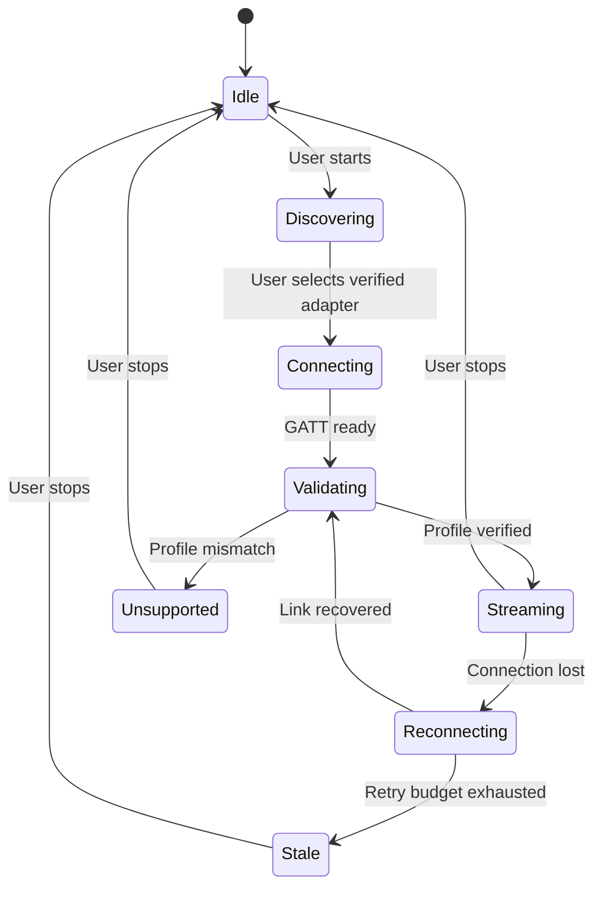

# Bluetooth integration and feasibility gate

## Initial supported path

Use an external BLE OBD adapter with documented third-party GATT/transport access, then a separately validated vehicle profile for SoC. Do not treat the car's audio/phone Bluetooth pairing as a telemetry API. BLE is the proposed first transport; manufacturer SDKs or supported Classic/MFi accessories can be evaluated independently.

Apple's current Core Bluetooth documentation mentions LE and BR/EDR support. Avoid the blanket claim that every Classic accessory is impossible or that arbitrary Bluetooth serial/vehicle data is accessible. Verify the specific iOS API, accessory protocol, authorization, and deployment target. Apple's External Accessory path has manufacturer/MFi constraints.

OBDLink CX is a **candidate for the first experiment**, because its manufacturer documents BLE and iOS support and discusses selective EV use with OEM-specific third-party apps. That does not establish this app's protocol access or support for an Enyaq or any other EV. Obtain the exact protocol/firmware documentation and permission to use it before selecting it.

## Layers and required evidence

| Layer | Evidence to collect | A successful result does not prove |
|---|---|---|
| Radio discovery | Advertised name/services on the target iPhone, foreground discovery time | Identity, protocol compatibility, or SoC |
| GATT connection | Actual service/characteristic UUIDs, properties, notifications, pairing/encryption behavior | A usable diagnostic session |
| Adapter transport | Documented framing, write type/MTU, echo/prompts, timeout behavior, firmware | A vehicle-specific metric exists |
| Vehicle read | Legitimate ECU/header, service/PID/DID, response framing, scaling, units, supported versions | Matching dashboard SoC or background reliability |
| Product telemetry | Comparison against the dashboard, freshness/latency, reconnect and invalid-value behavior | Other model years, trims, firmware, or adapters |
| Lifecycle and sleep | Locked/background behavior, explicit stop, sleep/12V impact, restoration results | Indefinite streaming after termination |

## M1 experiment

1. Record exact iPhone/iOS, adapter model/firmware, vehicle model/year/software, and test setup. Keep VIN/private IDs outside git.
2. Obtain developer documentation for GATT transport and a legitimate read-only vehicle profile. Record URLs/version, provenance, licensing, supported metric meaning, and any unknowns.
3. With the EV stationary, discover the adapter, connect, inspect documented characteristics, and verify a bounded request/response session. The bootstrap only implements step 1's discovery UI; a dedicated transport spike is needed for the rest.
4. Issue only reviewed, allowlisted vehicle reads at conservative, documented limits. Validate dashboard-vs-BMS SoC meaning and collect synchronized timestamped comparisons at multiple charge levels across sessions.
5. Capture fragmentation/timeouts/errors with a benign mock peripheral and sanitized replay fixtures. Do not inject malformed vehicle traffic.
6. Disconnect/reconnect, switch Bluetooth off, leave range, lock the phone, and test vehicle on/charging/asleep conditions. Measure what works rather than assuming foreground timers survive backgrounding.
7. Stop delivery explicitly and confirm the adapter/vehicle can sleep without app-caused periodic waking. Record measurements and unresolved hardware limitations.

Proposed foreground beta target: p95 sample age at most 5 seconds during an active session, reconnect within 10 seconds after a known peripheral is reachable, and agreement within 2 percentage points of the dashboard **if the profile claims dashboard-equivalent SoC**. These are initial product targets, not manufacturer guarantees; profile semantics may require a documented conversion or different metric. Report sample count, conditions, and confidence rather than cherry-picking a single result.

If no legitimate mapping/protocol access is available, mark the tuple unverified or unsupported and keep manual/cloud paths explicit. No guessed PID/DID/scaling is permitted.

## Production connection state machine

This state machine is planned, not implemented. All active states must also handle permission denial, powered-off/resetting Bluetooth, timeout, cancellation, profile mismatch, and explicit stop. Reconnecting uses bounded backoff and stable selected identity; no name-only trust. Handle callbacks from obsolete sessions with a generation token so late responses cannot update the wrong vehicle.

## Background behavior

The bootstrap is foreground-only and stops discovery on inactivity. Future `bluetooth-central` mode and state restoration require deliberate implementation and physical-device evidence. Do not add entitlement/background declarations merely to make a capability look complete.

Apple's archived guide describes event-based wakeups, constrained scanning, and termination/restoration. Current documentation also describes an iOS 26 Live Activity path for certain background privileges. Investigate that as a separate OS-specific feature; an active BLE link still does not guarantee a periodic diagnostic polling timer. Distinguish supported foreground telemetry from measured locked/background delivery, system termination, and user force-quit behavior. Display sample age and recover with manual/cloud input when needed.

## Compatibility records

`config/compatibility.json` starts with one unverified pilot candidate and no command definitions. Add support only after a report using `docs/evidence/HARDWARE_REPORT_TEMPLATE.md` is completed. Key support by vehicle/model-year/software, adapter/firmware, phone/iOS, metric semantics, profile version, and tested operating conditions. Preserve source provenance for sanitized fixtures.

## Primary references (checked 2026-10-01)

- [Apple: Core Bluetooth](https://developer.apple.com/documentation/corebluetooth)
- [Apple: Bluetooth technologies](https://developer.apple.com/bluetooth/)
- [Apple: External Accessory](https://developer.apple.com/documentation/externalaccessory)
- [Apple: background processing guide (archived; compare with current APIs)](https://developer.apple.com/library/archive/documentation/NetworkingInternetWeb/Conceptual/CoreBluetooth_concepts/CoreBluetoothBackgroundProcessingForIOSApps/PerformingTasksWhileYourAppIsInTheBackground.html)
- [OBDLink: CX adapter notes](https://support.obdlink.com/support/solutions/articles/43000746707-obdlink-cx-adapter-notes)
- [OBDLink: FAQ, including EV support limitations](https://www.obdlink.com/faq/)

Platform documentation and product support can change. Capture the versions used by each validation report.
